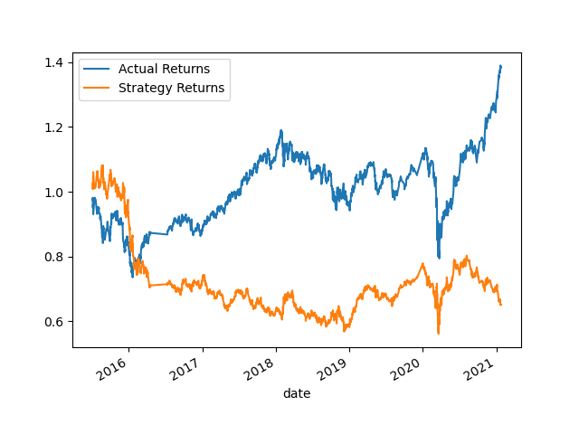
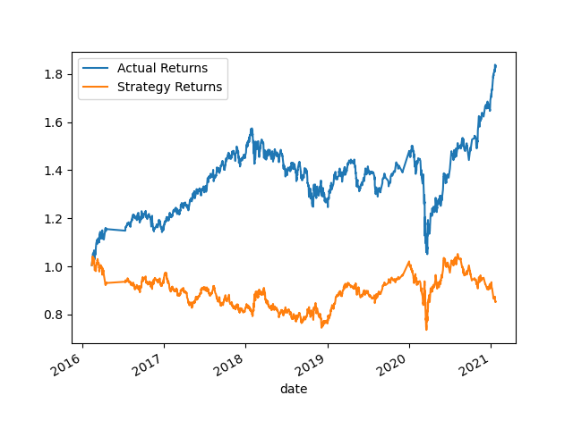

# Module-14-Challenge
## Machine Learning Trading Bot

Please find all code written in the machine_learning_trading_bot.ipynb file. 

### Establish a Baseline Performance

**SMA values:**
- short window = 4
- long window = 100

**Training period:**
- 3 months

The performance of the baseline trading algorithm is subpar, evident from the comparison of its strategy returns to the actual returns via the plot below. Taking a step further to examine the classification report, the recall is only 4% for -1 (sell signal), and thus 96% for 1 (buy signal). A recall of 4% for the "sell" signal means that out of all instances where the true label is "sell", the model correctly identified only 4% of them as sell signals. This indicates that the model has a low sensitivity or ability to detect sell signals accurately - meaning opportunities to sell and generate a greater return were missed. Overall, the low recall for sell signals and high recall for buy signals suggest that the model is biased towards predicting buy signals more often than sell signals, which may have negatively impacted the strategy returns. 

### Tune the Baseline Trading Algorithm

**What impact resulted from increasing or decreasing the training window?**
- When increasing the training window from 3 to 8 months, the recall is a bit more balanced between buy and sell signals, capturing 16% of "sell" signals and 83% of "buy" signals. The precision for the original training period of 3 months and increased training period of 8 months is the same - 43% for "sell" signal and 56% for "buy" signal. When examining the plot comparing cumulative strategy returns and actual returns – there doesn’t seem to be much benefit/ significant improvement in the strategy when the training period is increased from 3 to 8 months. 

**What impact resulted from increasing or decreasing either or both of the SMA windows?**
- While leaving the training window at the original 3 months, the short window was increased from 4 to 20 and the long window was increased from 100 to 200. From the classification report, the recall score is 15% for the "sell" signal (compared to 4%) and 87% for the "buy" signal (compared to 96%). The precision is similar at 46% for sell (compared to 43%) and 57% for buy (compared to 56%).  When examining the plot, there doesn’t seem to be much benefit or significant improvement in the cumulative strategy returns when the short and long windows are increased, similar to the result of only expanding the training window.

**Choose the set of parameters that best improved the trading algorithm returns. Save a PNG image of the cumulative product of the actual returns vs. the strategy returns, and document your conclusion.**
- In search to find the parameters that best improved the trading algorthim returns, I tried numerous combinations of varying windows (long and short) and varying training periods. My thought was that increasing both parameters would increase the outcome of the model, however if increased too much may result in overfitting. Ultimately, I decided upon a training period of 8 months, a short window of 20, and a long window of 200. With these paramteres - I found the recall and precision to be almost 50/50 for both buy and sell signals. The strategy returns with the tuned trading alogirthim yielded slightly higher results as per the plot below - findings show strategy returns sit between 0.8-1, versus 0.6-0.8 with the baseline model (see plot above). 
  

### Evaluate a New Machine Learning Classifier

**Did this new model perform better or worse than the provided baseline model?**

As per the plot below, it appears the new model performs better than the baseline model. The strategy returns initially peaks while actual returns declines, however thereafter strategy returns continue on a downwards trend and end off in 2021 around ~0.7 - which ends up being a similar end point to the baseline model in 2021 at ~0.7 as well. 
 
**Did this new model perform better or worse than your tuned trading algorithm?**

The new model initially performs better than the tuned trading agorithim in 2016-2017, however it then drops below 0.9 and ends just below 0.7. The tuned model begins to increase in 2019 and ends in 2021 above 0.8. Overall,  the tuning algorithim performs slightly better than the new model. 

### Evaluation Report

The baseline model (SVM), the tuned model, and the new model (Gradient Booster) did not significantly vary in terms of outcomes. Overall, the tuned model performed best, with strategy returns being relatively stable and ending off in 2021 at 0.8. The other two models ended around 0.7. The tuned model performing best demonstrates the importance of feature engineering and trial and error of using various parameters to find the best results. 
